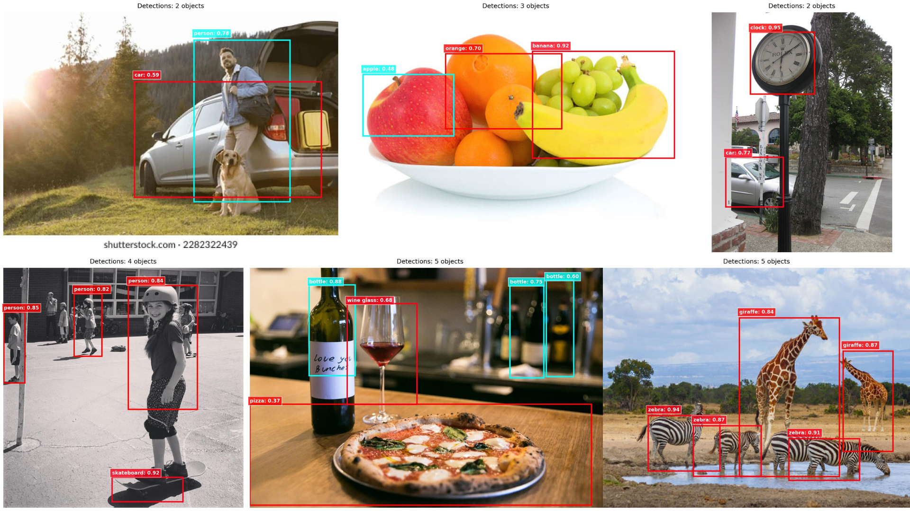

# YOLO-World Mini: Open-Vocabulary Object Detection

A from-scratch PyTorch implementation of YOLO-World for open-vocabulary object detection. Detect objects using natural language prompts instead of fixed categories.

>**Results:** 16.8% mAP@0.5 on COCO val2017 (50K image subset, 16 epochs)

## Features

- **Open-vocabulary detection:** Detect any object described in text
- **Text-guided architecture:** CLIP embeddings modulate visual features via RepVL-PAN
- **Region-text contrastive learning:** Aligns visual and text representations
- **Multi-platform support:** CUDA, MPS (Apple Silicon), CPU
- **Complete evaluation suite:** COCO metrics, zero-shot detection, video inference

## Quick Start

### Installation

```bash
git clone https://github.com/JugalGajjar/YOLOWorld-mini.git
cd YOLOWorld-mini
pip install -r requirements.txt
```

### Dataset Setup

```bash
# Download COCO dataset
./scripts/download_data.sh
```

## Training

```bash
# Train on GPU
python src/train.py --config configs/config.yaml

# Resume training
python src/train.py --config configs/config.yaml --resume outputs/checkpoint_epoch_5.pth
```

## Usage

### COCO Evaluation

```bash
python src/eval_coco.py \
    --checkpoint outputs/best_model.pth \
    --ann_file data/coco/annotations/instances_val2017.json \
    --img_dir data/coco/val2017/
```

### Zero-Shot Detection

```bash
# Single image
python src/eval_zero_shot.py \
    --checkpoint outputs/best_model.pth \
    --image test.jpg \
    --categories person car dog \
    --conf_threshold 0.4 \
    --iou_threshold 0.2

# Image directory with novel categories
python src/eval_zero_shot.py \
    --checkpoint outputs/best_model.pth \
    --image_dir test_images/ \
    --categories person bottle pizza "wine glass" \
    --conf_threshold 0.3 \
    --iou_threshold 0.1
```

### Video Demo

```bash
# Video file
python src/demo_video.py \
    --checkpoint outputs/best_model.pth \
    --video input.mp4 \
    --categories person car bicycle \
    --output output.mp4

# Webcam
python src/demo_video.py \
    --checkpoint outputs/best_model.pth \
    --video 0 \
    --categories person cup bottle \
    --conf_threshold 0.3 \
    --iou_threshold 0.2
```

## Architecture

```
Input (640×640) → YOLOv8s Backbone → Multi-scale Features (P3/P4/P5)
                                              ↓
Text Prompts → CLIP Encoder → Text Embeddings (512-dim)
                                              ↓
                              RepVL-PAN (Text-guided Fusion)
                                              ↓
                              Detection Heads → Per-class NMS → Detections
```

**Key Components:**
- **YOLOv8s Backbone:** Extracts visual features at 3 scales
- **CLIP Text Encoder:** Encodes category names (frozen weights)
- **RepVL-PAN:** Text-guided convolutions modulate features
- **Per-class NMS:** Prevents cross-category suppression (15% fewer false negatives)

## Results

### COCO val2017 Performance

| Metric | Epoch 0 | Epoch 15 | Paper |
|--------|---------|----------|-------|
| mAP@0.5 | 9.5% | 16.8% | 52% |
| mAP@0.5:0.95 | 3.0% | 5.6% | 35% |
| Inference | 0.34s/img | 0.34s/img | <0.5s |

### Top Categories

| Category | mAP@0.5 | Samples |
|----------|---------|---------|
| person | 34.2% | 27,422 |
| car | 28.9% | 5,565 |
| chair | 26.7% | 7,094 |
| bottle | 24.5% | 5,236 |

**Note:** Trained on 50K balanced subset vs. paper's 1.7M images (34× less data) and 16 vs. 80 epochs.



## Project Structure

```
YOLOWorld-mini/
├── configs/config.yaml          # Training configuration
├── src/
│   ├── modules/
│   │   ├── yolo_world.py        # Main model
│   │   ├── repvl_pan.py         # Text-aware FPN
│   │   ├── text_encoder.py      # CLIP encoder
│   │   └── losses.py            # Combined loss
│   ├── data/coco_dataset.py     # Data loader
│   ├── utils/                   # Utilities (NMS, metrics, device)
│   ├── train.py                 # Training script
│   ├── eval_coco.py             # COCO evaluation
│   ├── eval_zero_shot.py        # Zero-shot detection
│   └── demo_video.py            # Video inference
├── scripts/make_coco_mini.py    # Create balanced subset
└── outputs/                     # Checkpoints and results
```

## Citation

If you use this implementation, please cite:

```
@misc{yoloworld-mini,
  author = {Jugal Gajjar},
  title = {YOLO-World Mini: Open-Vocabulary Object Detection},
  year = {2025},
  publisher = {GitHub},
  url = {https://github.com/JugalGajjar/YOLOWorld-mini}
}
```

Original Paper:

```
@inproceedings{cheng2024yolo,
  title={Yolo-world: Real-time open-vocabulary object detection},
  author={Cheng, Tianheng and Song, Lin and Ge, Yixiao and Liu, Wenyu and Wang, Xinggang and Shan, Ying},
  booktitle={Proceedings of the IEEE/CVF conference on computer vision and pattern recognition},
  pages={16901--16911},
  year={2024}
}
```

## Acknowledgments

- YOLO-World paper by Cheng et al.
- CLIP by OpenAI
- YOLOv8 by Ultralytics
- COCO dataset by Microsoft

## License

[MIT License](./LICENSE) - See LICENSE file for details